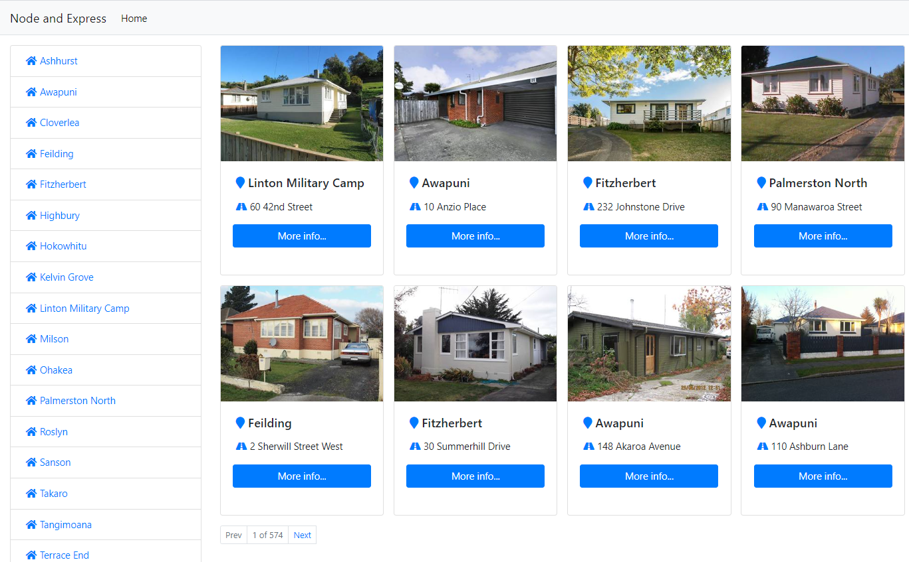

# Real estate site


This site shows a list of addresses around the Palmerston North area which you can filter by suburb. Click on "more info" to view a modal with some detailed info about the house.

It uses node and express with a phpmyadmin MySQL database in the back end. The views use Pug rather than plain HTML, and bootstrap for styling.

## Setting up the database
To set up the database I have provided a script which will create the table required and insert the relevant data.
I have called the database "realestate" but have a look at the connection info in the routes.js file if you can't connect to your own local db.

## How to run
1. Download the website either by forking the repository or downloading the zip file.
2. Install dependencies by typing ```npm install``` into the terminal. You will need to have node installed on your computer.
3. Set up the database as detailed above.
4. Make sure you have a PHP server + MySQL database (such as WAMP) running in the background.
5. Run the project using ```node app.js```. 
6. The site should be running on [localhost:3000](http://localhost:3000).

Note: it doesn't seem to work very well on Firefox - you may need to use Chrome.
